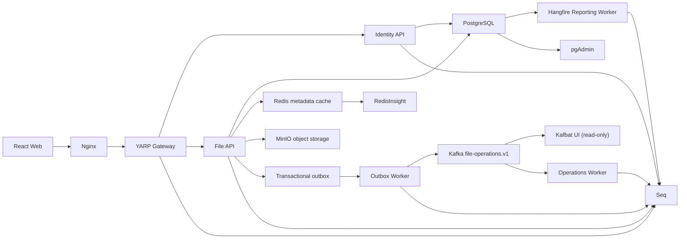

# MinIO File Management Final Proje Raporu

## Yönetici Özeti

MinIO File Management; dosya yaşam döngüsü, metadata persistence,
cache, kimlik yönetimi, API Gateway, güvenilir event pipeline,
zamanlanmış raporlama ve merkezi gözlemlenebilirliği tek bir
mini-microservice çözümünde birleştirir.

Temel final doğrulaması 4 Ağustos 2026 tarihinde tamamlanmıştır.
Görsel yönetim arayüzleri genişletmesi 5 Ağustos 2026 tarihinde
`feature/observability-uis` branch'inde, `develop` branch'indeki
`f6f90318908d8b8471d6866dd4db3a7d5f2c323a` tabanı üzerinde
doğrulanmıştır. Bu rapor güncellenirken commit, push veya merge
yapılmamıştır.

## Final Durum Matrisi

| Başlık | Durum | Final kanıtı |
|---|---|---|
| MinIO dosya yönetimi | Tamamlandı | Upload/list/detail/download/preview/presigned/delete E2E; hash eşitliği; frontend testleri |
| Redis metadata cache | Tamamlandı | Cache-aside, invalidation ve Redis kesintisinde PostgreSQL fallback |
| Serilog ve Seq | Tamamlandı | Merkezi yapılandırılmış loglar ve correlation ID |
| Hangfire reporting | Tamamlandı | PostgreSQL job storage, dashboard güvenliği, günlük rapor ve sayaç doğrulaması |
| Kafka operations pipeline | Tamamlandı | Transactional outbox, producer, consumer, üç operasyon ve lag `0` |
| Identity ve JWT | Tamamlandı | Login/me/admin runtime; issuer/audience/key/expiry negatif testleri |
| YARP API Gateway | Tamamlandı | Route/cluster/body limit ve correlation ID otomatik testleri |
| Docker Compose ve CI | Tamamlandı | 17 servis, restart politikaları, eksiksiz image build ve üç CI job |
| Mini-microservice finalizasyonu | Tamamlandı | İzole temiz E2E, tekrar üretilebilir betik, runbook ve final rapor |
| Görsel yönetim arayüzleri | Tamamlandı | Kafbat UI, RedisInsight, Reporting Swagger ve pgAdmin rehberi |

RabbitMQ proje yol haritasında bilinçli olarak kapsam dışı
bırakılmıştır. Asenkron operasyon gereksinimi Kafka ile
karşılanmaktadır.

## Mimari

## Temel Tasarım Kararları

- PostgreSQL dosya metadata'sı ve outbox için kaynak sistemdir.
- MinIO private object storage olarak kullanılır; dosya içeriği
  Redis'e yazılmaz.
- Redis yalnız cache-aside hızlandırma katmanıdır. Bağlantı hatası
  ana dosya akışını kesmez.
- Upload, download ve delete eventleri metadata değişikliğiyle aynı
  transaction sınırında outbox'a yazılır.
- Outbox Worker eventleri Kafka'ya yayımlar; Operations Worker
  otomatik commit kapalı şekilde tüketip offset'i işlemden sonra
  commit eder.
- Preview ve presigned URL üretimi kullanıcı download operasyonu
  sayılmaz.
- Reporting Worker API ölçeklemesinden ayrıdır ve Hangfire verisini
  PostgreSQL'de kalıcı tutar.
- Gateway dış API yüzeyini merkezileştirir ve correlation ID
  başlangıç noktasıdır.

## Otomatik Test Sonuçları

| Test grubu | Sonuç |
|---|---:|
| Contracts | 4 / 4 |
| Operations | 3 / 3 |
| Outbox | 10 / 10 |
| Identity ve JWT boundary | 11 / 11 |
| Gateway configuration ve middleware | 6 / 6 |
| Domain, application, persistence ve cache | 48 / 48 |
| Reporting | 17 / 17 |
| Backend toplam | 99 / 99 |
| Frontend auth, upload validation ve table davranışı | 11 / 11 |
| Genel toplam | 110 / 110 |

Frontend ayrıca lint, production build ve npm security audit
kontrollerini geçmiştir. Production build'deki büyük ana chunk
uyarısı işlevsel hata değildir; gelecekte route/component bazlı code
splitting ile iyileştirilebilir.

## İzole Runtime Doğrulaması

Final E2E doğrulaması normal `.env` ve mevcut proje verilerini
kullanmadan, ayrı Compose proje adı ve ayrı volume'larla
çalıştırılmıştır.

| Kontrol | Sonuç |
|---|---:|
| Compose service inventory | 17 |
| Çalışan uzun yaşayan servis | 14 |
| Başarılı tek-seferlik init işi | 3 |
| Uygulama ve yönetim health endpoint'i | 7 / 7 |
| Reporting Swagger ve OpenAPI | 200; Basic security scheme mevcut |
| Kafbat UI | healthy; login form; Kafka erişimi salt okunur |
| RedisInsight | healthy; Redis bağlantısı önceden tanımlı |
| Anonymous file erişimi | 401 |
| Hatalı login | 401 |
| Admin JWT login/me/ping | Başarılı |
| Upload/list/detail | Başarılı |
| Redis kapalıyken PostgreSQL fallback | Başarılı |
| Download/preview/presigned SHA-256 | Upload ile eşit |
| Delete sonrası detail | 404 |
| Outbox operasyonları | uploaded=1, downloaded=1, deleted=1 |
| Pending outbox | 0 |
| Maksimum Kafka consumer lag | 0 |
| Hangfire dashboard | anonymous=401, authorized=200 |
| Manuel rapor enqueue | 202 |
| Günlük rapor | upload=1, download=1, delete=1 |
| Rapor güvenilirlik sayaçları | pending=0, failed=0, invalid=0 |

Doğrulama sonunda yalnız izole projenin container, network ve
volume'ları silinmiş; mevcut normal stack ve repository verileri
korunmuştur.

## Güvenlik

- File endpoint'leri JWT gerektirir.
- Identity controller varsayılan olarak korumalıdır; register ve
  login açıkça anonymous olarak işaretlenmiştir.
- Admin endpoint'i role boundary uygular.
- JWT issuer, audience, signing key ve expiry doğrulanır.
- Hangfire dashboard ile reporting API ayrı Basic Authentication
  kimlik bilgileriyle korunur ve host portu yalnız loopback'e
  bağlanır.
- Kafbat UI kullanıcı girişiyle korunur, salt okunur modda çalışır
  ve yalnız loopback'e bağlanır.
- RedisInsight yalnız loopback'e bağlanır; bağlantı yönetimi
  kapalıdır ve lokal tanılama amacı taşır.
- Secret değerleri source control'e yazılmaz; `.env.example`
  placeholder içerir.
- .NET application container'ları non-root kullanıcıyla çalışır.

## Dayanıklılık ve Operasyon

- Uzun yaşayan 14 serviste `restart: unless-stopped` bulunur.
- Üç init job `restart: "no"` ile deterministik tek-seferlik işlerdir.
- API Redis hatasında fail-open davranıp PostgreSQL'e döner.
- Outbox publisher retry bilgilerini persistence üzerinde tutar.
- Hangfire job'ları retry, eşzamanlı çalışma kilidi ve idempotent
  günlük rapor anahtarı kullanır.
- Healthcheck bulunan servisler Compose startup dependency
  zincirinde hazır olma sinyali üretir.

## CI ve Branch Koruması

GitHub Actions üç bağımsız job çalıştırır:

1. Backend restore/audit, Release build, 99 test ve vulnerability
   raporu.
2. Frontend install, 11 test, lint, production build ve npm audit.
3. Compose configuration, tam 17 servis envanteri, sekiz özel image
   build, Kafbat UI ve RedisInsight image inspection.

`develop` branch'i değişikliklerin pull request üzerinden gelmesini
ve üç zorunlu kontrolün geçmesini gerektirir. Finalizasyon branch'i
doğrudan `develop` üzerine push edilmemeli; onay sonrası commit ve PR
akışı izlenmelidir.

## Üretim Öncesi Öneriler

Bu staj projesinin fonksiyonel kapsamı tamamlanmıştır. Gerçek üretim
ortamı için ayrıca şu yatırımlar önerilir:

- TLS termination ve private network policy
- secret manager veya orchestrator secret entegrasyonu
- PostgreSQL, MinIO ve Kafka backup/restore tatbikatları
- broker, database ve object storage için yüksek erişilebilirlik
- merkezi metrik, alert ve SLO tanımları
- load, soak ve daha büyük dosya performans testleri
- frontend route/component code splitting
- dependency update ve container image scanning politikası

## Sonuç

Dokuz final başlığın tamamı gerçek kod, otomatik test, container
build ve temiz runtime doğrulamasıyla tamamlanmıştır. Sistem dosya
yönetimini yalnız CRUD seviyesinde değil; güvenlik, cache,
güvenilir event teslimi, raporlama, gözlemlenebilirlik ve
operasyonel tekrar üretilebilirlik seviyelerinde de kanıtlamaktadır.
